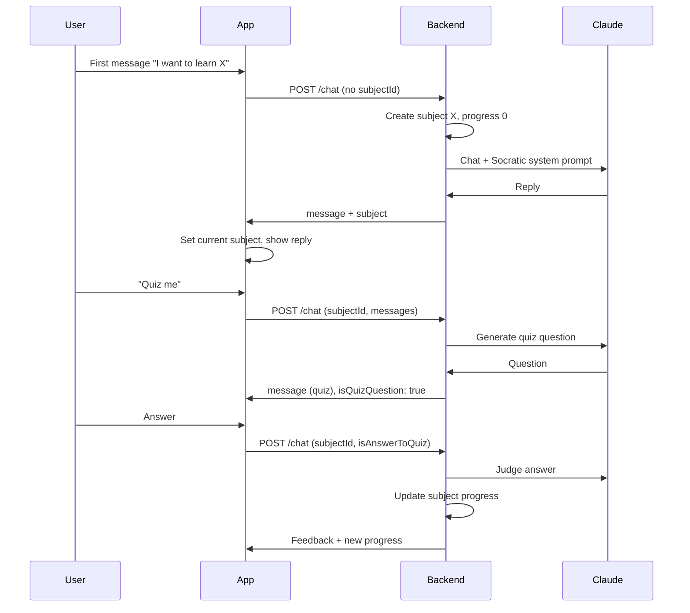

# LLM Teacher: Claude Integration and Learning Flow

## Current state

- **Chat**: [app/(tabs)/chat.tsx](app/(tabs)/chat.tsx) POSTs to FastAPI; [python/main.py](python/main.py) calls Ollama and returns one reply. No subject context or persistence.
- **Profile**: [app/(tabs)/profile.tsx](app/(tabs)/profile.tsx) uses a hardcoded `SUBJECTS` array; progress bars are static.
- **Landing**: [components/chat/LandingPage.tsx](components/chat/LandingPage.tsx) shows "Welcome Back" and a Profile button; no explicit "what do you want to learn?" prompt yet.
- No persistence layer (no DB, no AsyncStorage).

---

## Architecture (high level)

---

## 1. Claude API integration (backend)

**Goal:** Replace Ollama with Anthropic Claude in the Python backend while keeping the same client contract where possible.

- **Dependencies:** Add `anthropic` and `python-dotenv` (e.g. in a new `python/requirements.txt`). Use env var `ANTHROPIC_API_KEY` (never commit the key).
- **Changes in [python/main.py](python/main.py):**
  - Remove `ollama` usage.
  - For `POST /chat`: build a single prompt or message list from `request.messages`, call `anthropic.messages.create()` (e.g. `model="claude-3-5-sonnet-20241022"` or latest). Return `{ "message": content }` so the existing app still works.
  - Keep the same request/response shapes so [app/(tabs)/chat.tsx](app/(tabs)/chat.tsx) can stay as-is for the basic call (we will extend the contract in later steps).
- **Optional:** Support streaming later; for the plan, a single non-streaming reply is enough.

---

## 2. Subject persistence and API (backend)

**Goal:** Store subjects (name, progress, last activity) so the app can create and update them.

- **Storage:** Use SQLite (e.g. `sqlite3` stdlib or a small ORM) with a single table, e.g. `subjects (id, name, progress, last_message_at, created_at)`. For MVP, single-user is fine (no `user_id` required).
- **Endpoints:**
  - **GET /subjects** — List all subjects (for Profile screen). Response: array of `{ id, name, progress, lastMessage, icon? }`. `lastMessage` can be derived from `last_message_at` (e.g. "2 hours ago").
  - **POST /subjects** — Create subject. Body: `{ name }`. Return `{ id, name, progress: 0 }`. Used when the first user message is interpreted as a new learning goal.
  - **PATCH /subjects/:id** — Update progress (and optionally `last_message_at`). Body: `{ progress }`. Used after a correct quiz answer.
- **Initialization:** Create DB file and table on first run (e.g. in `main.py` startup or a small init script).

---

## 3. “First message creates subject” flow

**Goal:** When the user has no current subject and sends a message (e.g. “I want to learn calculus”), create a new subject with progress 0 and start the teaching conversation.

- **Backend:** Extend `POST /chat`:
  - Accept optional `subject_id` (nullable). If `subject_id` is missing and there is at least one user message, treat the first user message as the learning goal:
    - Parse or use the message text as the subject name (optionally use Claude to normalize, e.g. “I want to learn calculus” → “Calculus”).
    - Call `POST /subjects` internally (or insert into DB) to create the subject with progress 0.
    - Include the new subject’s `id` and `name` in the response so the client can set “current subject”.
  - Response shape: e.g. `{ message, subject?: { id, name, progress } }`. When the backend creates a subject, always return `subject` in the response.
- **Client ([app/(tabs)/chat.tsx](app/(tabs)/chat.tsx)):**
  - Add state: `currentSubject: { id, name, progress } | null`.
  - When sending a message: if `currentSubject` is null, do not send `subject_id`; when the response includes `subject`, set `currentSubject` to it.
  - When the user taps “New subject” (from Profile), clear `currentSubject` and clear `messages` (and `chatHistory`) so the next message is treated as a new learning goal. Optionally navigate to chat if not already there.
- **Landing / UX:** Update [components/chat/LandingPage.tsx](components/chat/LandingPage.tsx) (and/or the chat empty state) so the first screen clearly prompts the user, e.g. “What would you like to learn today?” so the first message is unambiguously the new subject.

---

## 4. Socratic teaching (system prompt)

**Goal:** Claude guides the user to discover answers instead of giving them directly.

- **Backend:** When calling Claude in `POST /chat`, set a **system prompt** that:
  - States the current subject (from `subject_id` or the newly created subject).
  - Instructs the model to act as a Socratic tutor: ask guiding questions, give hints, avoid giving the full answer until the user has reasoned through it. Keep responses concise and suitable for chat.
- Pass the conversation history (and optionally the subject name) so Claude can stay on topic. No change to the client contract beyond existing `messages` and `subject_id`.

---

## 5. Quiz flow in chat

**Goal:** User can say “quiz me” (or similar); Claude asks a question; the next user message is the answer; if correct, increment the subject’s progress.

- **Intent:** Backend detects “quiz me” (or “quiz”, “test me”, etc.) in the latest user message when `subject_id` is present. Optionally use a small Claude call to classify intent (quiz vs normal) for robustness.
- **When “quiz me” is detected:**
  - Do not add the user’s “quiz me” message to the teaching conversation as a normal turn; instead, call Claude with a **quiz-generation** system prompt (e.g. “Generate a single short quiz question for the subject X based on the conversation so far. Output only the question.”). Return that as the assistant message.
  - Mark this reply as a quiz question in the API response, e.g. `{ message, isQuizQuestion: true }`. Client will use this to know the next user message is an answer.
- **When the next message is an answer:**
  - Client sends something like `is_answer_to_quiz: true` (and `subject_id`, `messages` including the quiz question and the new user message).
  - Backend: Use Claude to judge if the answer is correct (e.g. system prompt: “You are a grader. Subject: X. Question: … User answer: … Reply with only CORRECT or INCORRECT and one short sentence of feedback.”). Parse response:
    - If correct: `PATCH /subjects/:id` to increase `progress` (e.g. +10, cap at 100). Return a success message including the new progress (e.g. “Correct! Progress: 50%.”).
    - If incorrect: Return feedback only, no progress change.
  - Response shape: e.g. `{ message, progress?: number }` so the client can update `currentSubject.progress` and show the new value.
- **Client:**
  - Track whether the last assistant message was a quiz question (e.g. flag on the last message or a `lastMessageIsQuiz` state). When the user sends the next message, set `is_answer_to_quiz: true` in the request.
  - When the response includes `progress`, update `currentSubject.progress` (and optionally refetch or invalidate subject list for Profile).

---

## 6. Profile screen: live subjects and progress

**Goal:** Profile shows real data from the backend and stays in sync with progress.

- **Data:** Replace the hardcoded `SUBJECTS` in [app/(tabs)/profile.tsx](app/(tabs)/profile.tsx) with data from **GET /subjects** (e.g. `useState` + `useEffect` fetch on mount and optionally on focus). Map API fields to the existing `Subject` type (`id`, `name`, `lastMessage`, `icon`, `progress`). Use a default icon per subject if the API does not return one.
- **Progress:** Progress bars already use `subject.progress`; once the list comes from the API (with updated progress after quizzes), they will show the correct values.
- **“New subject”:** Already navigates to `/chat`; ensure chat clears `currentSubject` and messages when arriving from “New subject” (e.g. via a query param or a global “new subject” action) so the next message creates a new subject.

---

## 7. Optional refinements (short term)

- **Landing copy:** Set LandingPage (or chat empty state) title/description to “What would you like to learn today?” so the first message is clearly the new subject.
- **Error handling:** If subject creation or quiz evaluation fails, return a clear error message in `message` and do not leave the client in an inconsistent state (e.g. do not set `currentSubject` if create failed).
- **Idempotency:** If the user sends two messages before the first response (e.g. “I want to learn math” then “Hello?”), decide whether to create the subject on the first message only (e.g. create on first user turn and attach that subject to the rest of the conversation).

---

## 8. File and contract summary

| Area           | Files to add/change                                                                                                                                                                  |
| -------------- | ------------------------------------------------------------------------------------------------------------------------------------------------------------------------------------ |
| Backend        | [python/main.py](python/main.py) (Claude, subjects CRUD, quiz logic), `python/requirements.txt` (anthropic, python-dotenv), optional `python/store.py` or inline SQLite for subjects |
| Chat screen    | [app/(tabs)/chat.tsx](app/(tabs)/chat.tsx) (currentSubject, subject in response, isAnswerToQuiz, clear on “New subject”)                                                             |
| Profile screen | [app/(tabs)/profile.tsx](app/(tabs)/profile.tsx) (fetch GET /subjects, remove hardcoded SUBJECTS)                                                                                    |
| Landing / UX   | [components/chat/LandingPage.tsx](components/chat/LandingPage.tsx) (prompt “What would you like to learn?”)                                                                          |
| Types          | Optional shared types for Subject and chat response (e.g. `subject?: { id, name, progress }`, `isQuizQuestion`, `progress`) in chat response                                         |

---

## 9. Implementation order

1. **Claude + env** — Replace Ollama with Claude in `main.py`, add `requirements.txt` and document `ANTHROPIC_API_KEY`.
2. **Subjects DB + API** — SQLite + GET/POST/PATCH subjects; no chat integration yet.
3. **Chat creates subject** — Extend POST /chat to create subject when no subject_id, return subject; client state and “New subject” reset.
4. **Socratic prompt** — Add system prompt for teaching behavior using subject name.
5. **Quiz flow** — Backend: detect “quiz me”, generate question, mark `isQuizQuestion`; next turn judge answer, PATCH progress, return feedback; client: send `is_answer_to_quiz`, update progress in state.
6. **Profile from API** — Fetch subjects from GET /subjects, remove hardcoded list.
7. **Copy and polish** — Landing prompt text, error messages, and any UX tweaks.

This keeps the existing app structure, adds a minimal persistence layer, and implements your desired flow: first message creates a subject with 0% progress, Socratic chat, and quiz-in-chat that advances the progress bar when the user answers correctly.